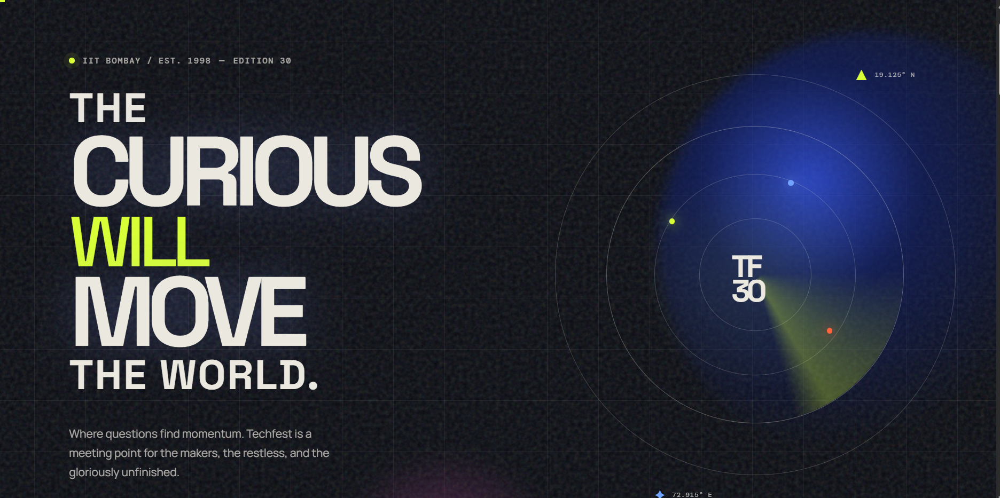

# Techfest Signal / 30

Signal / 30 is an independent landing-page concept for Techfest IIT Bombay. It presents the festival as a high-energy transmission for curious minds, built for a fast and responsive web experience.

## Preview



## Concept

A cinematic 2D signal-transmission aesthetic built around radar, technical grids, frequency visuals, and editorial typography. The experience uses CSS-led motion and visual texture only—no 3D assets.

## Features

- Pointer-reactive light on fine-pointer devices
- Animated radar, frequency waves, and signal details
- Scroll progress indicator
- Responsive navigation with keyboard support
- Purposeful hover interactions
- Smooth anchor navigation
- Reduced-motion support
- Responsive layouts from mobile to wide desktop

## Tech Stack

- React
- TypeScript
- Vite
- Lucide React
- CSS animations

## Local Development

```bash
pnpm install
pnpm run dev
